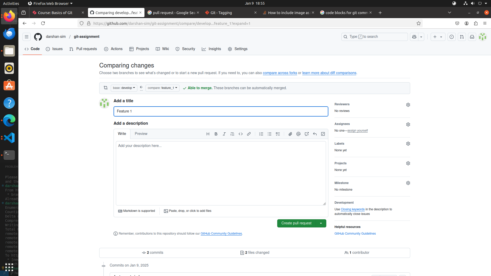
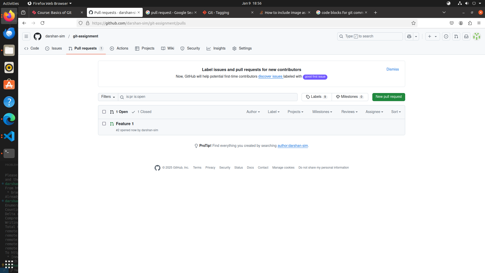
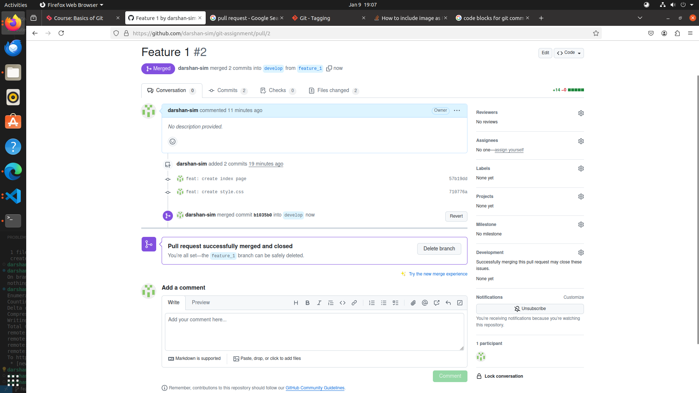
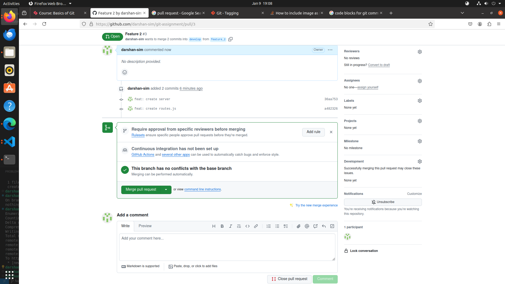

# Basics of git
 - create a develop branch for
  
---
## Git Exercise:

#### 1. Create a branch from the develop
```js
$ git checkout -b feature_1
```
---

#### 2. Add a commit message hook to the repo.

---
#### 3. Perform multiple commits in the new branch
```js
$ git add index.html
$ git commit -m 'feat: create index page'

$ git add style.css
$ git commit -m 'feat: create style.css'
```
---

#### 4. Create PR to develop
#### 5. PR should be small in size, It's recommended to do one commit per PR. However, based on the situation we can have multiple commits in PR. e.g. if someone is doing 10 bug fixes which are one-liner fixes in such cases instead of 10 different PRs you can do 10 commits in a single PR. 
```js
$ git push -u origin feature_1
```




---
#### 6. Create another branch from develop given your previous PR is still in review state 

```js
$ git pull origin develop
$ git checkout -b feature_2

```

---

#### 7. Now commit something in your current branch and push it
```js 
$ git add server.js
$ git commit -m 'feat: create server'

$ git add routes.js
$ git commit -m 'feat: create routes.js'

$ git push -u origin feature_2
```
---
#### 8. In the meantime, your previous PR has been merged to develop



---

#### 9. Create a PR for the current branch given your branch should be up to date with develop branch



---
#### 10. For any new build release add a version tag to that specific commit to keep track of each version.
#### 11. Create 2 another branch (3rd and 4th) from develop, push read me changes to 3rd brach.

```js
$ git add README.md
$ git commit -m "docs: update in README.md"
$ git tag -a v1.1 -m "v1.1"
$ git log
```
```js
commit 328634d7cc574abf21fa9728b68482d2ec9b33c1 (HEAD -> feature_3, tag: v1.1)
Author: darshan-sim <darshan.chaudhary@simformsolutions.com>
Date:   Thu Jan 9 19:38:51 2025 +0530

    docs: update in README.md

```


---
#### 12. Cherry pick 3rd branch's commit to 4th branch. 
```js
$ git checkout feature_4
$ git cherry-pick 8d4b59620f865b1a0810026b4c07c4e71fbbce23
$ git commit -m 'cherry-pick: cherry-pick from feature_3 to feature_4'
```

---
#### 13. Change commit message in 4th branch
```js
$ git commit --amend -m "style: change commit message"
```

---
#### 14. add 3 commit to 4th branch and delete last commit.
```js
$ git add .
$ git commit -m 'feat: create img folder and added images'

$ git add style.css
$ git commit -m 'feat: update stylesheet'

$ git add text.txt
$ git commit -m 'docs: create text.txt'

$ git log
commit 7e563dbfb4f55302319c1720b415cea1c776810a (HEAD -> feature_4)
Author: darshan-sim <darshan.chaudhary@simformsolutions.com>
Date:   Thu Jan 9 20:01:05 2025 +0530

    docs: create text.txt


$ git reset --hard HEAD~1
HEAD is now at 0f05287 feat: update stylesheet
$ git log
commit 0f05287e91d722fd2693eafbd2638df7730e22f0 (HEAD -> feature_4)
Author: darshan-sim <darshan.chaudhary@simformsolutions.com>
Date:   Thu Jan 9 20:00:19 2025 +0530

    feat: update stylesheet
```


